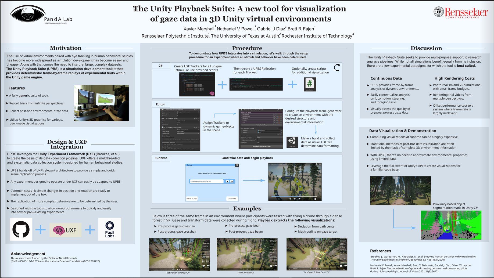

# UPBS - Unity Playback Suite
Built off the Unity Experiment Framework, UPBS is a collection of data analysis tools which allow for deterministic, frame-by-frame replays of experimental trials in their original environment. From there, developers can add additional visualizations and analysis directly in Unity.

This project was recently displayed at the Psychonomic Society 2022 confrence and a digital version can be viewed here:

These tools are still early in development, but this page will receive updates as development progresses.

## Features

### Data Collection
Data collection paradigms and processes are implemented using UXF's source. Minor modifications are made to support Playback features, but implementing UXF is procedurally identical here.

### Playback Environment Generation
Rather than dirtying the experimental environment, UPBS offers the ability to generate copies of said environment that carry over all information relevant to visual stimuli.

### Frame-By-Frame Playback
Scrub through each frame of trial data just as you would a video player with the ability to play in reverse and alter speed. The standard camera perspective in Playback environments is based on the subject's camera during data collection. However, you can add alternative camera perspectives or navigate the scene in 3D using the Free Camera.

### Data Visualization
UPBS provides a straightforward coding framework for adding visualizations extrapolated from collected data. Potential visualizations can include elements like raycasts, heatmaps, graph overlays, or other representations match an experimental paradigm.

### Additional Data Import
For experimental setups that require the use of external tools for data collection, UPBS allows that data to be introduced to Unity and visualized alongside Unity-side data. Given potential differences in recording rate and data formatting, some unique restrictions may apply to external data.

### Additional Data Export
Since UPBS provides replays with all of the original environmental state information relevant at runtime, it also supports the ability to export additional data during playback. This is especially useful for processes that would compromise frame-rate during experimentation.

### Video Examples

#### Simple Scene

[Simple scene - first-person view](Videos/DemoVideo_FPReconstructed90FPS.mp4)
[Simple Scene - First-person playback view](Videos/DemoVideo_PlaybackFPOBS.mp4)
[Simple Scene - Third-person view](Videos/DemoVideo_TPReconstructed.mp4)
[Simple Sceene - Third-person playback view](Videos/DemoVideo_PlaybackTPOBS.mp4)

#### Complex Scene

[Complex scene - first-person view](Videos/Movie5.mp4)
[Complex scene - top-down view](Videos/Movie6.mp4)

## Contact
For inquires on the project, feel free to reach out to me at xmarshall.dev@gmail.com
